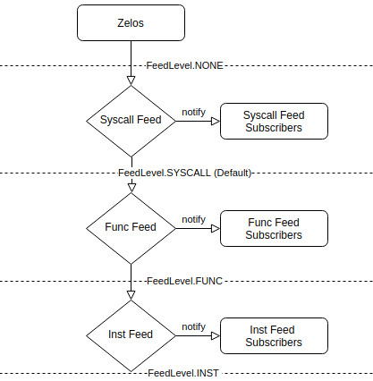

# 07 - ZML and Feeds

## Feeds Overview
Feeds are a way to subscribe to information that is retrieved from a
dynamic execution of a binary, while respecting the performance
optimizations that have been requested by the user. This allows users to
specify what kinds of information should be collected, and therefore the
performance cost, in a global way, without having to configure
multiple plugins separately.

To start with, there are different levels of feeds, each increasing in
amount of verbosity as well as performance cost:

                        ->  Verbosity  ->
            None -> Syscalls -> Functions -> Instructions
                        <- Performance <-

Which feeds are enabled is determined through a global "feed level".
Only feeds of the specified verbosity or less are provided data through
their subscribed callbacks.

For Example, when the feed level is FeedLevel.FUNC, subscribers to the
syscall and func feeds will be run, but no calls to inst feed
subscribers will be made.

Feeds are what powers the tracing capabilities of Zelos. In fact, the
--inst / --func / --syscall options set the starting feed level to
ensure that tracing is provided the appropriate information.

## Hooks Vs. Feeds
Both Hooks and Feeds provide a way of running code when certain events
occur. However, Hooks cannot be modified through the command line
(unless a plugin adds those capabilities). Feeds offer a unified way for
plugins to be controlled through the global "feed level".

### You should use Feeds if
  * You don't require complete information. You can handle only being provided information only within certain regions.
  * You want to use ZML to specify when to collect information without requiring a custom cmdline flag.

### You should use Hooks if
*  You require complete information. You cannot support partial information as a result of the changing feed level

## Conditional Feed Levels
It became increasingly important to have control over when to enable
information flow during an execution. Packed binaries may have behavior
that a user would want to view an instruction trace for, but the
unpacking stage may make such a trace prohibitively long/large. Our
desire would be to only trace the desired regions to improve
performance.

To this end we developed flags that take conditions which change the
feed level during execution. In addition, we specified a language that
can be used to control these dynamic feed level changes.

## ZML (Zelos Manipulation Language)
ZML is how we specify conditional events in Zelos. While the specific
grammar can be seen in [zml.py](https://github.com/zeropointdynamics/zelos/blob/master/src/zelos/zml.py),
overall ZML can be described as a set of conditions centered around an
event.

Example Events:
  * syscall=(name of syscall)
  * func=(name of function)
  * addr=(virtual address of instruction)
  * thread=(name of thread)

Example Conditions:
  * n=(number of times executed before triggering)
  * retval=(return value of syscall/func)
  * arg_(arg name)=(value of argument for syscall/func)
  * thread=(thread the event must occur on)

For each specified ZML string, there must be one event, combined with
any of the conditions (delimited by commas).

For example, "`syscall=read,arg_fd=7,n=2,thread=main`" is a valid ZML
string that will trigger when the second time the read syscall is called
on the thread "main" when the "fd" argument is passed 7.

## Using ZML with Feeds
ZML strings are passed to the --(syscall|func|inst|no)_feed command line
flags.

For example, To trigger instructions to be printed only after the 'recv'
syscall has been called, specify "`--inst_feed=syscall=recv`" on the
command line. For a script, add `inst_feed="syscall=recv"` as a keyword
argument in the Zelos constructor.

These command line flags can be specified multiple times, adjusting
the feed level every time any zml string is satisfied.

For more information on what options are available for configuring feeds
look at the zelos.zml module.
